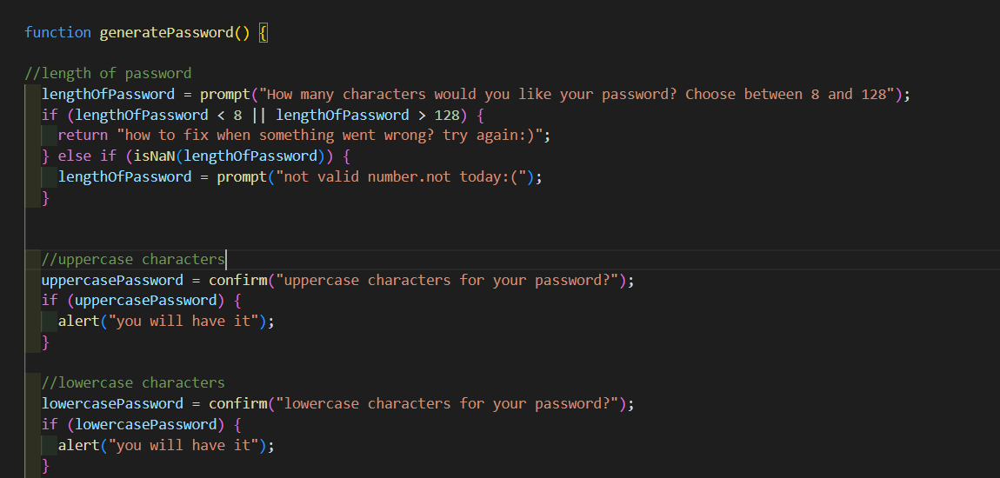
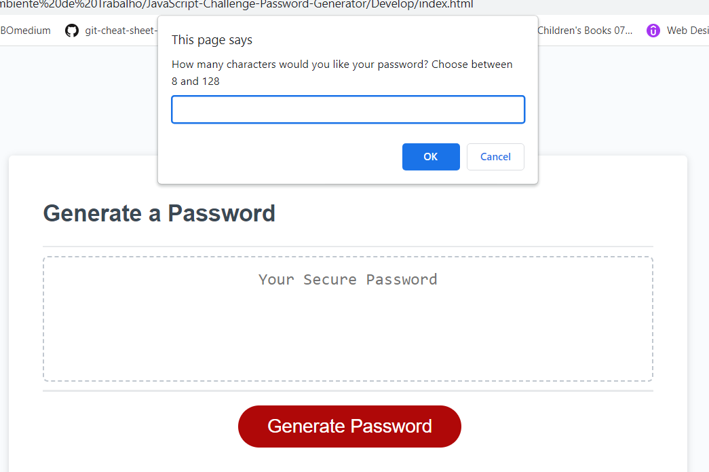
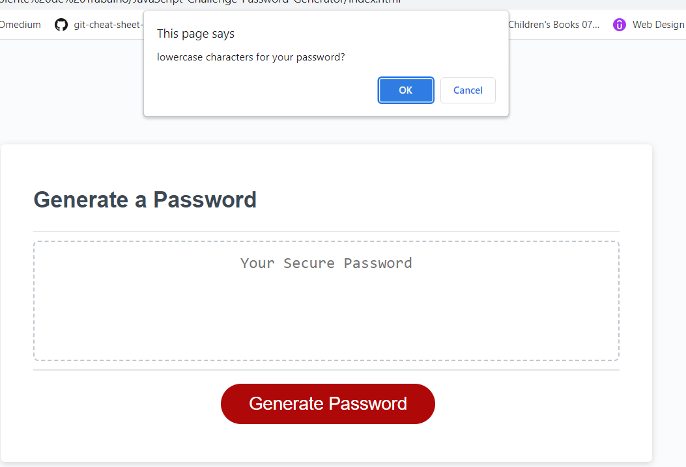
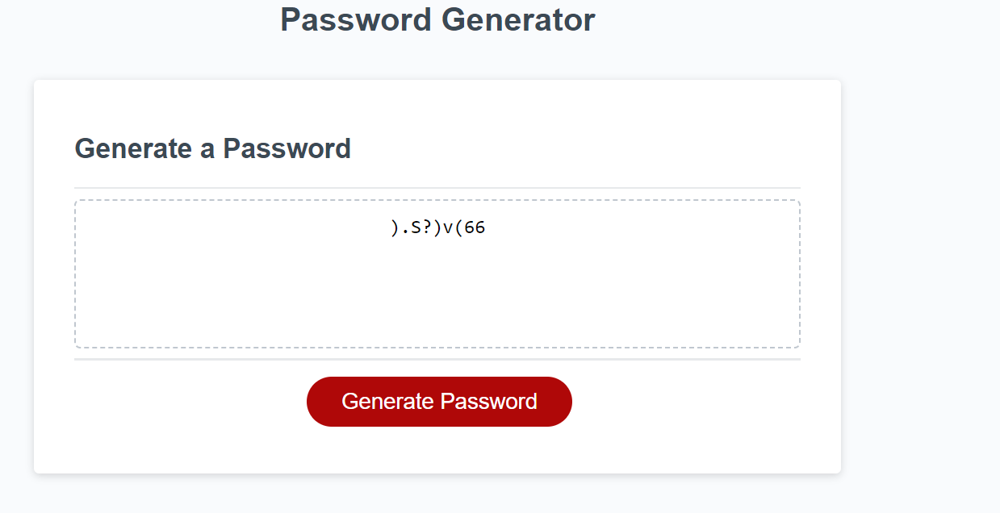

# JavaScript-Challenge-Password-Generator

## Description 📖

An application that an employee can use to generate a random password based on criteria they've selected. This app will run in the browser, and will feature dynamically updated HTML and CSS powered by JavaScript code.

# Acceptance Criteria 🔍

GIVEN I need a new, secure password

WHEN I click the button to generate a password
THEN I am presented with a series of prompts for password criteria

WHEN prompted for password criteria
THEN I select which criteria to include in the password

WHEN prompted for the length of the password
THEN I choose a length of at least 8 characters and no more than 128 characters

WHEN asked for character types to include in the password
THEN I confirm whether or not to include lowercase, uppercase, numeric, and/or special characters

WHEN I answer each prompt
THEN my input should be validated and at least one character type should be selected

WHEN all prompts are answered
THEN a password is generated that matches the selected criteria

WHEN the password is generated
THEN the password is either displayed in an alert or written to the page

# Built With 🛠

| Technology Used         | Resource URL           | 
| ------------- |:-------------:| 
| HTML    | [https://developer.mozilla.org/en-US/docs/Web/HTML](https://developer.mozilla.org/en-US/docs/Web/HTML) | 
| CSS     | [https://developer.mozilla.org/en-US/docs/Web/CSS](https://developer.mozilla.org/en-US/docs/Web/CSS)      |   
| JavaScript | [https://www.javascript.com/](https://www.javascript.com/)     | 


## Code Refactor Example 🔦

part of the function with series of prompts for password criteria:



## Usage 

when a button is clicked:



on the way:




in the very end:




```

# Author 👩‍💻

[][1]

[1]: https://github.com/poucoLouco

[][2]

[2]:https://www.linkedin.com/in/roksolana-odynak-25728025a


# License 📄

[](https://opensource.org/licenses/MIT)